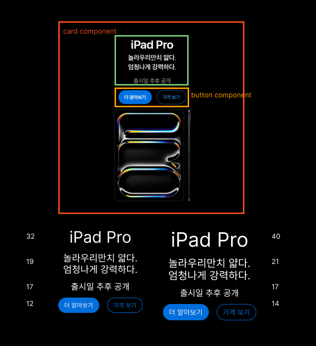

# [24.05.16] 4주차 과제

**🍎apple 제품 카드 만들기~!🍎**

> 그리드를 사용하여 구현하고 구현 결과를 움직이는 이미지로 생성하여 삽입해주세요.

### 1. 그리드 레이아웃 만들기

### 2. 컴포넌트 만들기

- 버튼 컴포넌트
- 카드 컴포넌트

### 3. 레이아웃 합치기

- 카드 컴포넌트 컨텐츠 변경
- 백그라운드 이미지 설정
- 포커스 설정

### 4. 기타

- 복습도 할겸 navigation과 header를 추가해보았다.

### 5. 마무리

- 너무너무 재밌었다~!

### ++ 추가

- 저는 이렇게 시작했답니다,, 🏀
- 이게 마지막 과제라니 너무 아쉬워요..,.,

  
