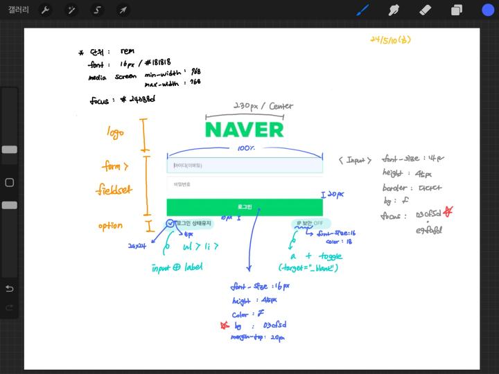

# [24.05.10] 3주차 과제
**🍏 네이버 로그인 박살내기 🍏**
 
예,, 이번 주 과제는요,,
### 『반응형 Naver 로그인 폼 만들기~!』

<b>🎯 내가 생각한 핵심,,</b>
 

1. 모바일 퍼스트 환경 / 반응형 레이아웃
2. 마우스, 키보드, 스크린 리더 접근성 고려하기
3. 변수 활용하기
4. ON/OFF의 경우, 오늘 checkbox 컴포넌트 배움 + 토글 버튼 언급이 있었음

<b>🤔 과정</b>
 

~~세상에 이런 명필이 또 있을까?~~

1. 마크업 구조 / 스타일 정리해보기
2. 네이버 로그인 폼이니까 네이버 폰트 써야징~
3. 변수를 사용하자! (font-family, color ...)
4. 모바일 환경에 맞춰서 마크업과 스타일링을 챱챱 해줘요.
5. 768 해상도에 맞춰서 ~~~!@## 해줘요.
6. <b>~~끝~~</b> 123!@#$123 이 아니라, 로고 이미지가 ,, 네.,, 
 

<b>☠️ 어려워요 ☠️</b>
 

1. svg 이미지를 지원하지 않는 브라우저 환경에서는 png 이미지를 사용할 것.
  <b>➡️ ...?/ ~~지원하지 않는 브라우저가 사라지면 될 일,,~~</b>
  이 부분이 제일 어려웠다,,. basic-html-css 내의 파일을 여러 번 훑어봤지만
  👀 눈 앞이 컴컴(come come)해요 👀
  요래조래 검색해보고 일단 마무리하긴 했지만 이미지를 알맞게 넣은건지 아직 잘 모르겠다. 😵